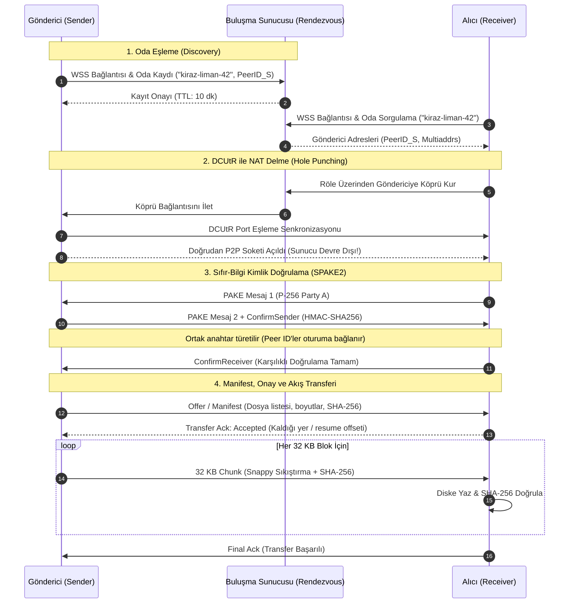
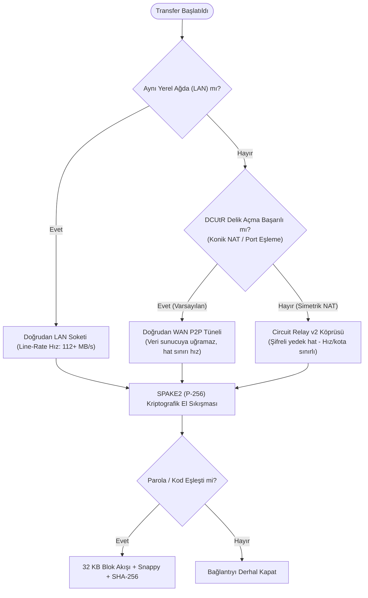

# PureSend — Mimari ve Algoritma Akışı (Architecture & Protocol Spec)

Bu belge; PureSend (FileTransferilla) eşler arası (P2P) dosya aktarım sisteminin ağ topolojisini, şifreleme mekanizmalarını ve algoritma akışını şematik olarak açıklar.

---

## 1. Sistem ve Ağ Topolojisi (System Topology)

PureSend, merkezi sunucularda veri depolamadan doğrudan cihazdan cihaza (Zero-Trust P2P) transfer sağlar:

---

## 2. Uçtan Uca Algoritma ve Protokol Akışı (Sequence Diagram)

PureSend protokolünün 4 ana adımı (Sinyal, NAT Delme, SPAKE2 Doğrulama, Akış):

---

## 3. Ağ Taşıyıcı ve Fallback Karar Ağacı (Traversal Flowchart)

Bağlantı koşullarına göre çalışma zamanı rota seçimi:

---

## 4. Temel Algoritma Prensipleri

1. **Sıfır Güven (Zero-Trust) Buluşma:**
   * Buluşma sunucusu dosya içeriğini veya dosya adlarını göremez.
   * Sunucu, gönderici yerine araya kendi sahte düğümünü koyamaz (Impersonation koruması); çünkü istemciler SPAKE2 el sıkışmasında Peer ID'leri HMAC anahtarına bağlar.
2. **Sabit Bellekli Akış ($O(1)$ RAM):**
   * Dosyalar belleğe yüklenmez; sabit 32 KB dilimler (chunks) halinde okunup Snappy ile sıkıştırılarak doğrudan ağ soketine verilir.
   * Alıcı tarafında her dilim diske yazılırken anlık SHA-256 hash havuzuna beslenir.
3. **Kaldığı Yerden Devam (Resume):**
   * Bağlantı koptuğunda alıcı, diske kısmen yazılmış `.part` dosyasının boyutunu ve hash durumunu göndericiye aktarır; aktarım yalnızca eksik kalan bayttan devam eder.
4. **Dosya Sistemi Güvenliği (SafeJoin):**
   * Gelen manifestteki tüm yollar `SafeJoin` filtresinden geçer; mutlak yollar (`/etc/passwd`), dizin atlamalar (`../`) ve tehlikeli sistem aygıt adları (`CON`, `PRN`, `AUX`) otomatik temizlenir.
