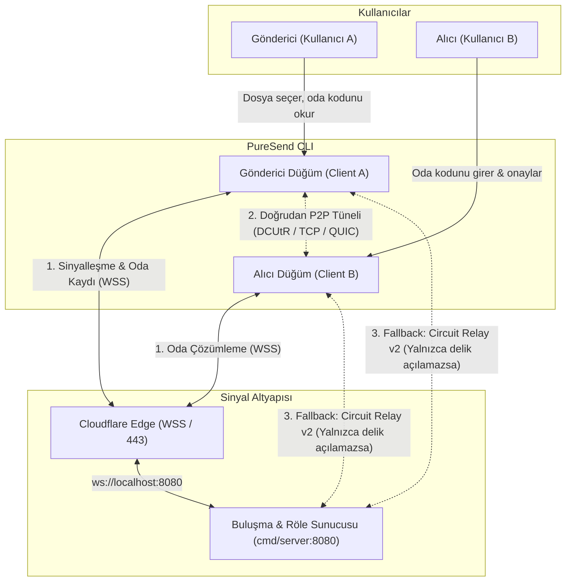
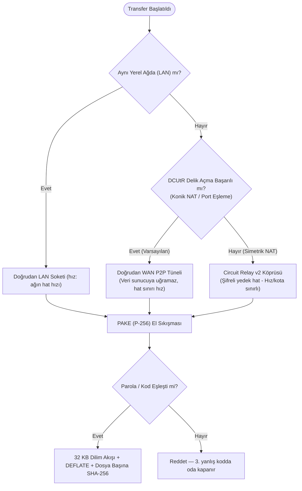

# PureSend — Mimari ve Algoritma Akışı (Architecture & Protocol Spec)

Bu belge; PureSend eşler arası (P2P) dosya aktarım sisteminin ağ topolojisini, şifreleme mekanizmalarını ve algoritma akışını şematik olarak açıklar.

---

## 1. Sistem ve Ağ Topolojisi (System Topology)

PureSend, merkezi sunucularda veri depolamadan doğrudan cihazdan cihaza (uçtan uca şifreli P2P) transfer sağlar. Buluşma sunucusu yalnızca eşleri tanıştırır; dosyaları göremez ve oda kodunun gizli kelimelerini hiç öğrenmez:



---

## 2. Uçtan Uca Algoritma ve Protokol Akışı (Sequence Diagram)

PureSend protokolünün 4 ana adımı (Sinyal, NAT Delme, PAKE Doğrulama, Akış):

```mermaid
sequenceDiagram
    autonumber
    participant S as Gönderici (Sender)
    participant Rnd as Buluşma Sunucusu (Rendezvous)
    participant R as Alıcı (Receiver)

    Note over S,Rnd: 1. Oda Eşleme (Discovery)
    S->>Rnd: WSS Bağlantısı & Oda Kaydı (yalnızca adresler, PeerID_S)
    Rnd-->>S: Oda numarası "42" (TTL: en fazla 1 saat)
    Note over S: Gizli kelimeleri kendisi seçer → kod "kiraz-liman-42"
    S-->>R: Kod sesli/yazılı iletilir (sunucu dışından)
    R->>Rnd: WSS Bağlantısı & Oda Sorgulama (yalnızca "42")
    Rnd-->>R: Gönderici Adresleri (PeerID_S, Multiaddrs)

    Note over S,R: 2. DCUtR ile NAT Delme (Hole Punching)
    R->>Rnd: Röle Üzerinden Göndericiye Köprü Kur
    Rnd->>S: Köprü Bağlantısını İlet
    S->>R: DCUtR Port Eşleme Senkronizasyonu
    S-->>R: Doğrudan P2P Soketi Açıldı (Sunucu Devre Dışı!)

    Note over S,R: 3. Kodun Tamamıyla Kimlik Doğrulama (PAKE)
    R->>S: PAKE Mesaj 1 (P-256, parola: kodun tamamı)
    S->>R: PAKE Mesaj 2
    Note over S,R: Ortak anahtar türetilir (Peer ID'ler oturuma bağlanır)
    R->>S: ConfirmReceiver (HMAC-SHA256)
    S->>R: ConfirmSender — yalnızca alıcınınki doğruysa
    Note over S: 3 yanlış kodda oda kapanır

    Note over S,R: 4. Manifest, Onay ve Akış Transferi
    S->>R: Offer / Manifest (Dosya listesi, boyutlar, SHA-256)
    R-->>S: Transfer Ack: Accepted (Kaldığı yer / resume offseti)
    
    loop Her 32 KB Dilim İçin
        S->>R: 32 KB Dilim (küçülüyorsa DEFLATE HuffmanOnly ile sıkıştırılmış)
        R->>R: Diske Yaz (.part) & Dosyanın SHA-256 Özetine Ekle
    end
    Note over R: Dosya bitince SHA-256 karşılaştırılır; eşleşirse kalıcı adına taşınır

    R->>S: Final Ack (Transfer Başarılı)
```

---

## 3. Ağ Taşıyıcı ve Fallback Karar Ağacı (Traversal Flowchart)

Bağlantı koşullarına göre çalışma zamanı rota seçimi:



---

## 4. Temel Algoritma Prensipleri

1. **Güvenilmeyen Buluşma Sunucusu:**
   * El sıkışma `schollz/pake` kütüphanesinin SPAKE2 tarzı değişimidir; RFC 9382 SPAKE2 ya da CPace değildir. Güvenliği taşıyan kısımlar (iki kimliğin anahtara bağlanması ve karşılıklı onay etiketleri) projenin kendi kodudur; gerekçe `internal/transfer/auth.go` içindedir.
   * Oda kodu iki parçadır: `kiraz-liman-42` kodunda `42` sunucunun verdiği, herkese açık oda numarasıdır (nameplate); `kiraz-liman` göndericinin kendi seçtiği gizli kısımdır (16 bit) ve sunucuya hiç gönderilmez.
   * Sunucu dosya içeriğini veya dosya adlarını göremez. Göndericinin yerine kendi düğümünü koymak ya da alıcı gibi davranmak için gizli kelimeleri tahmin etmesi gerekir: her deneme bir el sıkışmadır, başarısızlık görünür, ve gönderici 3 yanlış koddan sonra odayı kapatır.
   * İstemciler PAKE el sıkışmasında iki Peer ID'yi de anahtara bağlar; arada mesaj taşıyan bir eş iki ucu birbirine bağlayamaz.
2. **Sabit Bellekli Akış ($O(1)$ RAM):**
   * Dosyalar belleğe yüklenmez; sabit 32 KB dilimler (chunks) halinde okunur, küçülüyorsa DEFLATE (`flate.HuffmanOnly`) ile sıkıştırılır, küçülmüyorsa olduğu gibi gönderilir.
   * Alıcı tarafında her dilim diske yazılırken dosyanın SHA-256 özetine eklenir; özet dosya bitince bir kez karşılaştırılır.
3. **Kaldığı Yerden Devam (Resume):**
   * Bağlantı koptuğunda alıcı, `.puresend-partial` içindeki `.part` dosyasının boyutunu göndericiye bildirir; aktarım yalnızca eksik kalan bayttan devam eder.
   * "Bu dosya bende zaten var" cevabı yalnızca yarıda kalmış bir PureSend aktarımının bitirdiği dosyalar için verilir; gönderici hedef klasörde başka dosyaların varlığını bu yolla sorgulayamaz.
4. **Dosya Sistemi Güvenliği:**
   * Gelen manifestteki tüm yollar `safeJoin` denetiminden geçer; mutlak yollar (`/etc/passwd`), dizin atlamalar (`../`), ayrılmış `.puresend-partial` klasörü ve Windows aygıt adları (`CON`, `PRN`, `AUX`) onarılmaz, reddedilir.
   * Hedef klasör ev klasörünün kendisi ya da üstündeki bir klasör olamaz; hedefteki sembolik bağlantıların içinden yazılmaz; var olan hiçbir dosyanın üzerine yazılmaz.
